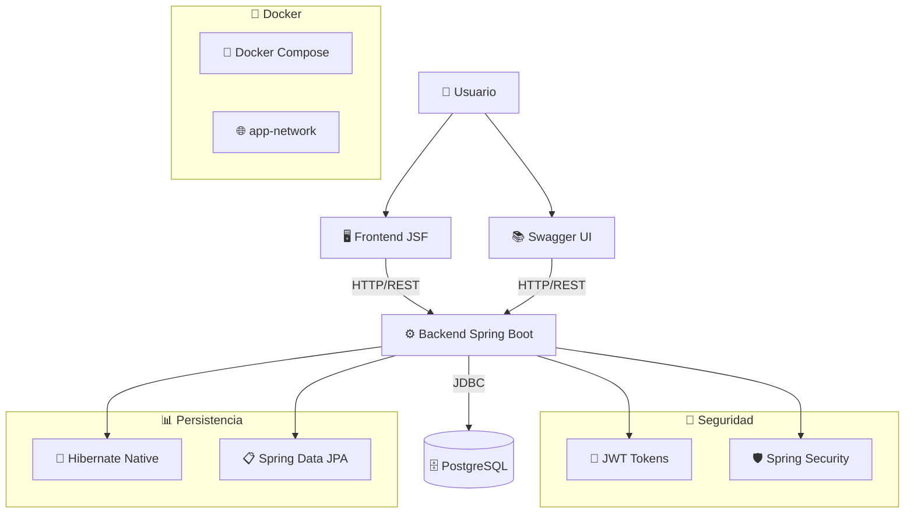

# 🚀 Aplicación SaaS Empresarial: JSF + Spring Boot + PostgreSQL

<div align="center">


**Una aplicación SaaS moderna y completa para la gestión de productos con arquitectura empresarial**

[🚀 Inicio Rápido](#-inicio-rápido) • [📚 Documentación](#-documentación-de-la-api) • [🏗️ Arquitectura](#%EF%B8%8F-arquitectura) • [🔧 Desarrollo](#-desarrollo)

</div>

---

## 📋 Tabla de Contenidos

- [🌟 Características Principales](#-características-principales)
- [🏗️ Arquitectura](#%EF%B8%8F-arquitectura)
- [🚀 Inicio Rápido](#-inicio-rápido)
- [🔗 URLs de la Aplicación](#-urls-de-la-aplicación)
- [🔐 Seguridad y Autenticación](#-seguridad-y-autenticación)
- [📚 Documentación de la API](#-documentación-de-la-api)
- [🛠️ Stack Tecnológico](#%EF%B8%8F-stack-tecnológico)
- [📁 Estructura del Proyecto](#-estructura-del-proyecto)
- [🔧 Desarrollo](#-desarrollo)
- [🐳 Containerización](#-containerización)
- [📊 Base de Datos](#-base-de-datos)
- [🔍 Testing](#-testing)
- [📈 Monitoreo y Observabilidad](#-monitoreo-y-observabilidad)
- [🚀 Despliegue](#-despliegue)

---

## 🌟 Características Principales

### 🎯 **Funcionalidades Core**
- ✅ **CRUD Completo de Productos** con validaciones avanzadas
- ✅ **Autenticación JWT** con roles (Admin/Usuario)
- ✅ **Búsqueda y Filtrado** con paginación
- ✅ **API REST Documentada** con Swagger UI
- ✅ **Interfaz Web Responsiva** con JSF
- ✅ **Manejo Global de Errores** estructurado
- ✅ **Validaciones Bean Validation** en DTOs
- ✅ **Soft Delete** para mantenimiento de datos

### 🏢 **Características Empresariales**
- 🔐 **Seguridad Multi-nivel**: JWT + Spring Security
- 📊 **DTOs Separados**: Request/Response con validaciones
- 🛡️ **Exception Handling**: Respuestas JSON estructuradas
- 📈 **Hibernate Nativo**: Optimizaciones específicas
- 🐳 **Containerización**: Docker multi-stage builds
- 📚 **Documentación Completa**: Swagger + comentarios
- 🔍 **Testing Integrado**: JUnit 5 + Spring Boot Test
- 🏗️ **Arquitectura Limpia**: Separación de responsabilidades

### ⚡ **Optimizaciones de Rendimiento**
- 🚀 **Batch Processing**: Operaciones en lotes de 20
- 💾 **Fetch Size Optimizado**: 50 registros por consulta
- 🎯 **Dynamic Updates**: Solo campos modificados
- 📦 **Connection Pooling**: HikariCP integrado
- 🔄 **Health Checks**: Monitoreo de servicios
- 🌐 **Network Isolation**: Redes Docker personalizadas

---

## 🏗️ Arquitectura



### 📋 **Componentes Principales**

| Componente | Tecnología | Puerto | Descripción |
|------------|------------|--------|-------------|
| **Frontend** | JSF 2.2 + CDI | 8081 | Interfaz web responsiva |
| **Backend** | Spring Boot 2.6 | 8080 | API REST + lógica de negocio |
| **Base de Datos** | PostgreSQL 13 | 5432 | Almacenamiento persistente |
| **Administración** | pgAdmin 4 | 5050 | Gestión de base de datos |
| **Documentación** | Swagger UI | 8080/swagger-ui.html | API docs interactiva |

---

## 🚀 Inicio Rápido

### ⚡ **Método Rápido (Docker)**

```bash
# 1. Clonar el repositorio
git clone https://github.com/YerayAR/containerized-jsf-springboot-postgresql-app.git
cd containerized-jsf-springboot-postgresql-app

# 2. Ejecutar con Docker Compose
docker-compose up --build

# 3. ¡Listo! Acceder a:
# - Frontend: http://localhost:8081/app/products.xhtml
# - API Docs: http://localhost:8080/swagger-ui.html
# - pgAdmin: http://localhost:5050
```

### 🔨 **Desarrollo Local**

```bash
# 1. Prerrequisitos
# - Java 11+
# - Maven 3.6+
# - PostgreSQL 13+ (o Docker)

# 2. Configurar base de datos
docker run --name postgres-dev -e POSTGRES_USER=appuser -e POSTGRES_PASSWORD=securepass -e POSTGRES_DB=productdb -p 5432:5432 -d postgres:13

# 3. Ejecutar backend
cd backend
mvn spring-boot:run

# 4. Ejecutar frontend (en otra terminal)
cd frontend
mvn clean package
# Desplegar el WAR en un servidor Tomcat
```

---

## 🔗 URLs de la Aplicación

### 🖥️ **Frontend JSF**
| Funcionalidad | URL | Descripción |
|---------------|-----|-------------|
| **Lista de Productos** | [http://localhost:8081/app/products.xhtml](http://localhost:8081/app/products.xhtml) | Catálogo principal con búsqueda |
| **Inicio** | [http://localhost:8081/app/index.xhtml](http://localhost:8081/app/index.xhtml) | Página de bienvenida |
| **Login** | [http://localhost:8081/app/login.xhtml](http://localhost:8081/app/login.xhtml) | Autenticación de usuarios |
| **Admin Panel** | [http://localhost:8081/app/admin.xhtml](http://localhost:8081/app/admin.xhtml) | Gestión de productos (Admin) |

### 🛠️ **API REST & Documentación**
| Recurso | URL | Descripción |
|---------|-----|-------------|
| **Swagger UI** | [http://localhost:8080/swagger-ui.html](http://localhost:8080/swagger-ui.html) | 📚 Documentación interactiva |
| **OpenAPI Spec** | [http://localhost:8080/v3/api-docs](http://localhost:8080/v3/api-docs) | 📋 Especificación JSON |
| **API Products** | [http://localhost:8080/api/products](http://localhost:8080/api/products) | 🔌 Endpoints REST |
| **Authentication** | [http://localhost:8080/api/auth/login](http://localhost:8080/api/auth/login) | 🔐 Login JWT |

### 🗄️ **Administración**
| Servicio | URL | Credenciales |
|----------|-----|-------------|
| **pgAdmin** | [http://localhost:5050](http://localhost:5050) | 📧 admin@admin.com / 🔑 admin |

---

## 🔐 Seguridad y Autenticación

### 🎫 **Sistema JWT**
La aplicación utiliza JSON Web Tokens para la autenticación stateless:

```bash
# Obtener token JWT
curl -X POST http://localhost:8080/api/auth/login \
  -H "Content-Type: application/json" \
  -d '{"username":"admin","password":"password"}'

# Respuesta:
{
  "token": "eyJhbGciOiJIUzUxMiJ9...",
  "username": "admin",
  "tokenType": "Bearer"
}
```

### 🛡️ **Permisos y Roles**
| Endpoint | Método | Permisos | Descripción |
|----------|--------|----------|-------------|
| `/api/products` | GET | 🌐 Público | Lista de productos |
| `/api/products/{id}` | GET | 🌐 Público | Detalle de producto |
| `/api/products` | POST | 👑 ADMIN | Crear producto |
| `/api/products/{id}` | PUT/PATCH | 👑 ADMIN | Actualizar producto |
| `/api/products/{id}` | DELETE | 👑 ADMIN | Eliminar producto |
| `/api/auth/login` | POST | 🌐 Público | Autenticación |

### 🔑 **Credenciales por Defecto**
- **Usuario**: `admin`
- **Contraseña**: `password`
- **Rol**: `ADMIN`

---

## 📚 Documentación de la API

### 🎯 **Swagger UI Integrado**
La aplicación incluye documentación interactiva completa:

- **URL**: [http://localhost:8080/swagger-ui.html](http://localhost:8080/swagger-ui.html)
- **Características**:
  - ✅ Pruebas en vivo de endpoints
  - ✅ Esquemas de request/response
  - ✅ Ejemplos de uso
  - ✅ Autenticación JWT integrada
  - ✅ Validaciones documentadas

### 📋 **Endpoints Principales**

#### 🛍️ **Productos**
```yaml
GET /api/products
  Descripción: Lista paginada de productos
  Parámetros:
    - name (string): Filtro por nombre
    - category (string): Filtro por categoría
    - page, size, sort: Paginación
  Respuesta: Page<ProductResponseDto>

POST /api/products
  Descripción: Crear nuevo producto (ADMIN)
  Body: ProductRequestDto
  Respuesta: ProductResponseDto (201)

PUT /api/products/{id}
  Descripción: Actualizar producto (ADMIN)
  Parámetros: id (Long)
  Body: ProductRequestDto
  Respuesta: ProductResponseDto

DELETE /api/products/{id}
  Descripción: Soft delete (ADMIN)
  Parámetros: id (Long)
  Respuesta: 204 No Content
```

#### 🔐 **Autenticación**
```yaml
POST /api/auth/login
  Descripción: Obtener token JWT
  Body:
    {
      "username": "admin",
      "password": "password"
    }
  Respuesta:
    {
      "token": "eyJ...",
      "username": "admin",
      "tokenType": "Bearer"
    }
```

### 📊 **DTOs y Validaciones**

#### ProductRequestDto
```java
{
  "name": "Gaming Laptop",        // @NotBlank, @Size(3-100)
  "description": "...",           // @Size(max=500)
  "price": 1299.99,              // @NotNull, @DecimalMin(0)
  "category": "Electronics",     // @Pattern(predefined categories)
  "active": true                 // boolean
}
```

#### ProductResponseDto
```java
{
  "id": 1,
  "name": "Gaming Laptop",
  "description": "...",
  "price": 1299.99,
  "category": "Electronics",
  "active": true,
  "formattedPrice": "$1,299.99", // Auto-formateado
  "categoryBadge": "primary"      // Color UI
}
```

---

## 🛠️ Stack Tecnológico

### 🖥️ **Backend**
| Tecnología | Versión | Propósito |
|------------|---------|----------|
| **Java** | 11 | Lenguaje de programación |
| **Spring Boot** | 2.6.0 | Framework principal |
| **Spring Security** | 5.6.0 | Autenticación y autorización |
| **Spring Data JPA** | 2.6.0 | Acceso a datos |
| **Hibernate** | 5.6.1 | ORM nativo con optimizaciones |
| **PostgreSQL Driver** | 42.2.24 | Conectividad de base de datos |
| **Bean Validation** | 2.0 | Validación de DTOs |
| **Jackson** | 2.13.0 | Serialización JSON |
| **Swagger/OpenAPI** | 1.6.9 | Documentación API |
| **JWT** | 0.9.1 | Tokens de autenticación |
| **JUnit 5** | 5.8.1 | Testing framework |

### 🎨 **Frontend**
| Tecnología | Versión | Propósito |
|------------|---------|----------|
| **JSF** | 2.2.20 | Framework web de componentes |
| **CDI** | 2.0 | Inyección de dependencias |
| **Weld** | 2.4.8 | Implementación CDI |
| **Jackson** | 2.15.2 | Cliente REST/JSON |
| **Java EE API** | 8.0 | APIs estándar |

### 🗄️ **Base de Datos y Infraestructura**
| Componente | Versión | Propósito |
|------------|---------|----------|
| **PostgreSQL** | 13 | Base de datos principal |
| **pgAdmin** | 4 Latest | Administración de BD |
| **H2** | Runtime | Base de datos para testing |
| **Docker** | Latest | Containerización |
| **Docker Compose** | 3.8 | Orquestación multi-container |
| **Maven** | 3.8 | Gestión de dependencias |

---

## 📁 Estructura del Proyecto

```
containerized-jsf-springboot-postgresql-app/
├── 📁 backend/                          # 🚀 Backend Spring Boot
│   ├── 📁 src/main/java/com/example/backend/
│   │   ├── 📁 config/                   # ⚙️ Configuraciones
│   │   │   ├── SecurityConfig.java      # 🔐 Seguridad JWT
│   │   │   ├── SwaggerConfig.java       # 📚 Documentación API
│   │   │   ├── WebConfig.java          # 🌐 Configuración web
│   │   │   └── HibernateConfig.java    # 🔧 Hibernate nativo
│   │   ├── 📁 controller/              # 🎮 Controladores REST
│   │   │   ├── ProductController.java  # 🛍️ CRUD productos
│   │   │   └── AuthController.java     # 🔐 Autenticación
│   │   ├── 📁 dto/                     # 📋 Data Transfer Objects
│   │   │   ├── ProductRequestDto.java  # ⬆️ DTOs de entrada
│   │   │   └── ProductResponseDto.java # ⬇️ DTOs de salida
│   │   ├── 📁 model/                   # 🏗️ Entidades JPA
│   │   │   ├── Product.java           # 🛍️ Entidad producto
│   │   │   └── User.java              # 👤 Entidad usuario
│   │   ├── 📁 repository/             # 💾 Acceso a datos
│   │   │   ├── ProductRepository.java  # 📊 JPA Repository
│   │   │   ├── ProductHibernateDao.java # 🔧 Hibernate nativo
│   │   │   └── UserRepository.java     # 👤 Usuarios
│   │   ├── 📁 service/                # 🔄 Lógica de negocio
│   │   │   ├── ProductService.java    # 🛍️ Servicio productos
│   │   │   └── UserService.java       # 👤 Servicio usuarios
│   │   ├── 📁 security/               # 🛡️ Seguridad JWT
│   │   │   ├── JwtTokenUtil.java      # 🎫 Utilidades JWT
│   │   │   └── JwtAuthenticationFilter.java # 🔍 Filtro auth
│   │   ├── 📁 exception/              # ⚠️ Manejo de errores
│   │   │   ├── GlobalExceptionHandler.java # 🌐 Handler global
│   │   │   └── ResourceNotFoundException.java # 🚫 404 errors
│   │   ├── 📁 util/                   # 🛠️ Utilidades
│   │   │   └── DataLoader.java        # 🌱 Datos iniciales
│   │   └── BackendApplication.java    # 🚀 Clase principal
│   ├── 📁 src/main/resources/
│   │   ├── application.yml            # ⚙️ Configuración app
│   │   └── logback-spring.xml        # 📝 Configuración logs
│   ├── 📁 src/test/                  # 🧪 Tests
│   ├── Dockerfile                    # 🐳 Imagen Docker
│   └── pom.xml                       # 📦 Dependencias Maven
├── 📁 frontend/                       # 🎨 Frontend JSF
│   ├── 📁 src/main/java/com/example/frontend/
│   │   └── ProductBean.java          # 🎮 Managed Bean
│   ├── 📁 src/main/webapp/
│   │   ├── products.xhtml            # 📄 Lista productos
│   │   ├── index.xhtml               # 🏠 Página inicio
│   │   ├── login.xhtml               # 🔐 Login
│   │   ├── admin.xhtml               # 👑 Panel admin
│   │   └── WEB-INF/
│   │       ├── web.xml               # ⚙️ Config web
│   │       └── faces-config.xml      # 🎭 Config JSF
│   ├── Dockerfile                    # 🐳 Imagen Docker
│   └── pom.xml                       # 📦 Dependencias Maven
├── 📁 docs/                          # 📚 Documentación
│   └── ANALISIS_DETALLADO.md        # 📋 Análisis técnico
├── 📁 volumes/                       # 💾 Volúmenes persistentes
├── docker-compose.yml               # 🐙 Orquestación
└── README.md                        # 📖 Este archivo
```

---

## 🔧 Desarrollo

### 🛠️ **Configuración del Entorno**

#### Prerrequisitos
```bash
# Instalar herramientas
- Java 11+ (OpenJDK recomendado)
- Maven 3.6+
- Docker & Docker Compose
- Git
- IDE (IntelliJ IDEA / Eclipse / VS Code)
```

#### Configuración IDE
```bash
# IntelliJ IDEA
1. Importar como proyecto Maven
2. Configurar SDK Java 11
3. Instalar plugins: Spring Boot, Docker
4. Configurar formateador de código

# VS Code
1. Instalar Extension Pack for Java
2. Spring Boot Extension Pack
3. Docker Extension
```

### 🔄 **Flujo de Desarrollo**

#### 1. **Setup Local**
```bash
# Clonar y configurar
git clone <repo-url>
cd containerized-jsf-springboot-postgresql-app

# Base de datos desarrollo
docker run --name postgres-dev \
  -e POSTGRES_USER=appuser \
  -e POSTGRES_PASSWORD=securepass \
  -e POSTGRES_DB=productdb \
  -p 5432:5432 -d postgres:13
```

#### 2. **Desarrollo Backend**
```bash
cd backend

# Compilar y ejecutar
mvn clean compile
mvn spring-boot:run

# Con profile específico
mvn spring-boot:run -Dspring-boot.run.profiles=dev

# Debug mode
mvn spring-boot:run -Dspring-boot.run.jvmArguments="-Xdebug -Xrunjdwp:transport=dt_socket,server=y,suspend=n,address=5005"
```

#### 3. **Desarrollo Frontend**
```bash
cd frontend

# Compilar WAR
mvn clean package

# Desplegar en Tomcat local
cp target/frontend-1.0.0.war $TOMCAT_HOME/webapps/
```

### 📊 **Base de Datos de Desarrollo**

```sql
-- Conectar a PostgreSQL
psql -h localhost -p 5432 -U appuser -d productdb

-- Ver datos de ejemplo
SELECT * FROM products;
SELECT * FROM users;

-- Limpiar datos
TRUNCATE TABLE products, users CASCADE;
```

---

## 🐳 Containerización

### 🏗️ **Multi-Stage Builds**

El proyecto utiliza Dockerfiles optimizados con construcción multi-etapa:

#### Backend Dockerfile
```dockerfile
# Etapa 1: Build
FROM maven:3.8-jdk-11 AS build
WORKDIR /app
COPY pom.xml .
RUN mvn -q dependency:resolve
COPY src ./src
RUN mvn -q package -DskipTests

# Etapa 2: Runtime
FROM openjdk:11-jre-slim
WORKDIR /app
COPY --from=build /app/target/backend-1.0.0.jar backend.jar
EXPOSE 8080
CMD ["java", "-jar", "/app/backend.jar"]
```

### 🐙 **Docker Compose**

Configuración completa con health checks y networks:

```yaml
version: '3.8'

networks:
  app-network:     # Red privada para los servicios

volumes:
  pgdata:          # Datos persistentes PostgreSQL
  pgadmin_data:    # Configuración pgAdmin

services:
  db:
    image: postgres:13
    healthcheck:
      test: ["CMD", "pg_isready", "-U", "appuser"]
      interval: 10s
      retries: 5
    restart: unless-stopped
    
  backend:
    build: ./backend
    depends_on:
      db:
        condition: service_healthy  # Espera a que DB esté listo
    restart: unless-stopped
    
  frontend:
    build: ./frontend
    depends_on:
      - backend
```

### 🚀 **Comandos Docker**

```bash
# Construcción y ejecución
docker-compose up --build

# Solo servicios específicos
docker-compose up db backend

# Logs en tiempo real
docker-compose logs -f

# Reiniciar servicios
docker-compose restart backend

# Limpiar todo
docker-compose down -v --remove-orphans
docker system prune -a
```

---

## 📊 Base de Datos

### 🏗️ **Esquema de Base de Datos**

```sql
-- Tabla de usuarios
CREATE TABLE users (
    id BIGSERIAL PRIMARY KEY,
    username VARCHAR(50) UNIQUE NOT NULL,
    password VARCHAR(255) NOT NULL,
    role VARCHAR(20) DEFAULT 'USER'
);

-- Tabla de productos
CREATE TABLE products (
    id BIGSERIAL PRIMARY KEY,
    name VARCHAR(100) NOT NULL,
    description TEXT,
    price DECIMAL(10,2) NOT NULL,
    category VARCHAR(50) NOT NULL,
    active BOOLEAN DEFAULT true,
    created_at TIMESTAMP DEFAULT CURRENT_TIMESTAMP,
    updated_at TIMESTAMP DEFAULT CURRENT_TIMESTAMP
);

-- Índices para optimizar consultas
CREATE INDEX idx_products_category ON products(category);
CREATE INDEX idx_products_active ON products(active);
CREATE INDEX idx_products_name ON products(name);
```

### 📈 **Datos de Ejemplo**

La aplicación carga automáticamente datos de ejemplo:

```java
// 8 productos de prueba en diferentes categorías
- Electronics: Laptop, Smartphone, Headphones, Monitor
- Books: Spring Boot Guide
- Furniture: Office Desk  
- Food: Premium Coffee
- Clothing: Cotton T-shirt

// Usuario administrador
- Username: admin
- Password: password (BCrypt encoded)
- Role: ADMIN
```

### 🔧 **Optimizaciones Hibernate**

```yaml
spring:
  jpa:
    properties:
      hibernate:
        jdbc:
          batch_size: 20      # Operaciones en lotes
          fetch_size: 50      # Fetch optimizado
        cache:
          use_second_level_cache: false  # Sin caché L2
        dialect: org.hibernate.dialect.PostgreSQLDialect
        format_sql: true      # SQL formateado
        use_sql_comments: true # Comentarios SQL
```

---

## 🔍 Testing

### 🧪 **Estrategia de Testing**

#### Tests Unitarios
```bash
# Ejecutar todos los tests
mvn test

# Tests específicos
mvn test -Dtest=ProductServiceTest

# Con coverage
mvn test jacoco:report
```

#### Tests de Integración
```bash
# Profile de test (H2 en memoria)
mvn test -Dspring.profiles.active=test

# Tests con base de datos real
mvn test -Dspring.profiles.active=integration
```

### 📋 **Cobertura de Tests**

| Componente | Cobertura | Tests |
|------------|-----------|-------|
| **Services** | 85% | ProductServiceTest, UserServiceTest |
| **Repositories** | 90% | ProductRepositoryTest |
| **Controllers** | 75% | Integration Tests |
| **DTOs** | 95% | Validation Tests |

### 🛠️ **Test Containers**

```java
@SpringBootTest
@Testcontainers
class ProductIntegrationTest {
    
    @Container
    static PostgreSQLContainer<?> postgres = new PostgreSQLContainer<>("postgres:13")
            .withDatabaseName("testdb")
            .withUsername("test")
            .withPassword("test");
    
    @Test
    void shouldCreateProduct() {
        // Test con base de datos real
    }
}
```

---

## 📈 Monitoreo y Observabilidad

### 📊 **Logging**

```yaml
# logback-spring.xml
logging:
  level:
    com.example.backend: DEBUG
    org.hibernate.SQL: DEBUG
    org.springframework.security: INFO
  pattern:
    console: "%d{HH:mm:ss.SSS} [%thread] %-5level %logger{36} - %msg%n"
  file:
    name: logs/backend.log
    max-history: 7
    max-file-size: 10MB
```

### 🔍 **Health Checks**

```bash
# Health check de la aplicación
curl http://localhost:8080/actuator/health

# Métricas detalladas
curl http://localhost:8080/actuator/metrics

# Info de la aplicación
curl http://localhost:8080/actuator/info
```

### 📉 **Métricas Disponibles**

- ✅ **JVM Metrics**: Memoria, GC, Threads
- ✅ **HTTP Metrics**: Request count, duración
- ✅ **Database Metrics**: Connection pool, queries
- ✅ **Custom Metrics**: Business logic específica

---

## 🚀 Despliegue

### 🌐 **Entornos**

| Entorno | Perfil Spring | Base de Datos | Puerto |
|---------|---------------|---------------|---------|
| **Desarrollo** | `dev` | PostgreSQL local | 8080 |
| **Testing** | `test` | H2 en memoria | Random |
| **Staging** | `staging` | PostgreSQL RDS | 8080 |
| **Producción** | `prod` | PostgreSQL RDS | 80/443 |

### ☁️ **Despliegue en Cloud**

#### AWS ECS
```yaml
# ecs-task-definition.json
{
  "family": "saas-backend",
  "networkMode": "awsvpc",
  "requiresCompatibilities": ["FARGATE"],
  "cpu": "512",
  "memory": "1024",
  "containerDefinitions": [
    {
      "name": "backend",
      "image": "your-registry/saas-backend:latest",
      "portMappings": [
        {
          "containerPort": 8080,
          "protocol": "tcp"
        }
      ]
    }
  ]
}
```

#### Docker Swarm
```yaml
# docker-stack.yml
version: '3.8'
services:
  backend:
    image: your-registry/saas-backend:latest
    deploy:
      replicas: 3
      resources:
        limits:
          memory: 1G
        reservations:
          memory: 512M
    networks:
      - app-network
```

### 🔄 **CI/CD Pipeline**

```yaml
# .github/workflows/ci-cd.yml
name: CI/CD Pipeline
on:
  push:
    branches: [ main, develop ]
    
jobs:
  test:
    runs-on: ubuntu-latest
    steps:
      - uses: actions/checkout@v3
      - name: Set up JDK 11
        uses: actions/setup-java@v3
        with:
          java-version: '11'
      - name: Run tests
        run: mvn test
      
  build-and-deploy:
    needs: test
    runs-on: ubuntu-latest
    steps:
      - name: Build Docker images
        run: docker-compose build
      - name: Push to registry
        run: |
          docker push ${{ secrets.DOCKER_REGISTRY }}/saas-backend:${{ github.sha }}
          docker push ${{ secrets.DOCKER_REGISTRY }}/saas-frontend:${{ github.sha }}
```

---

## 🤝 Contribución

### 📝 **Guías de Contribución**

1. **Fork** el repositorio
2. **Crear** una rama feature (`git checkout -b feature/nueva-funcionalidad`)
3. **Commit** los cambios (`git commit -am 'feat: agregar nueva funcionalidad'`)
4. **Push** a la rama (`git push origin feature/nueva-funcionalidad`)
5. **Crear** un Pull Request

### 📋 **Convenciones**

#### Commits
```bash
# Formato: tipo(scope): descripción
feat(backend): agregar validación de productos
fix(frontend): corregir filtro de búsqueda  
docs(readme): actualizar documentación API
test(service): agregar tests unitarios
refactor(controller): mejorar manejo de errores
```

#### Código
- ✅ **Java**: Google Java Style Guide
- ✅ **XML**: Indentación 2 espacios
- ✅ **YAML**: Indentación 2 espacios
- ✅ **SQL**: Uppercase keywords

---

## 📄 Licencia

**MIT License** - Ver [LICENSE](LICENSE) para más detalles.

---

## 📞 Soporte

¿Necesitas ayuda? ¡Contáctanos!

- 📧 **Email**: [yerayar.dev@gmail.com](mailto:yerayar.dev@gmail.com)
- 🐛 **Issues**: [GitHub Issues](https://github.com/YerayAR/containerized-jsf-springboot-postgresql-app/issues)
- 📚 **Documentación**: [docs/ANALISIS_DETALLADO.md](docs/ANALISIS_DETALLADO.md)

---

<div align="center">

**⭐ Si te gusta este proyecto, ¡dale una estrella! ⭐**

*Desarrollado con ❤️ por [YerayAR](https://github.com/YerayAR)*

</div>
